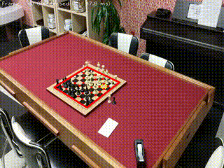
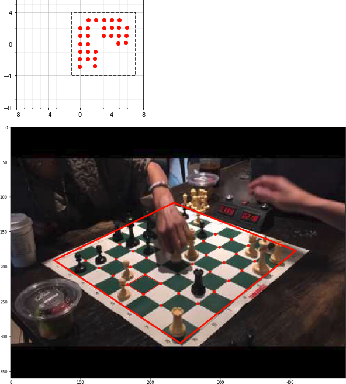
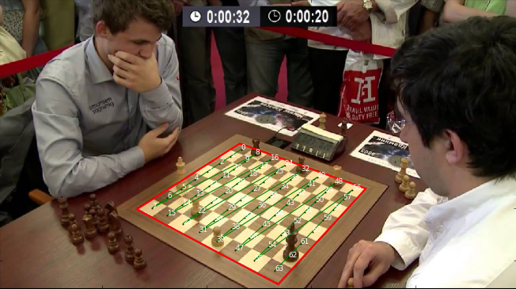
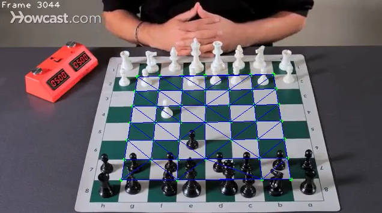
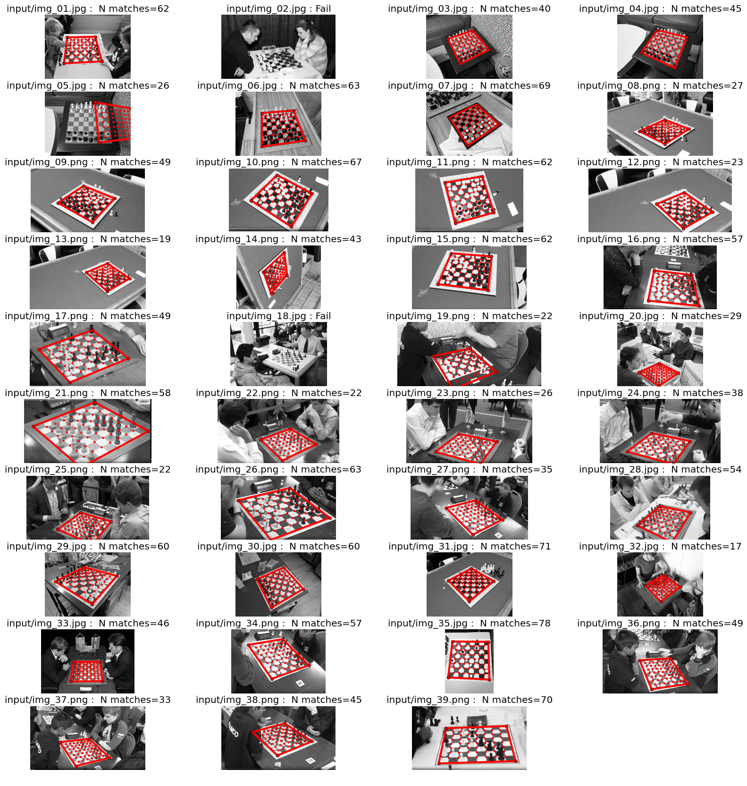
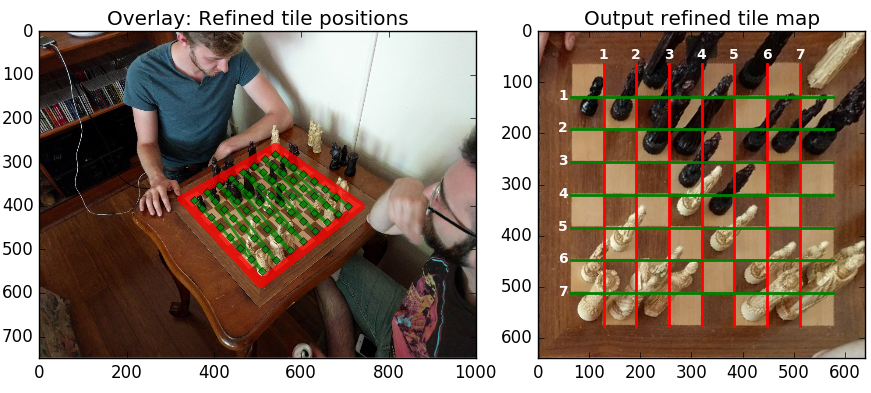

# Chessboard Detection

*Note* : This repo is a staging ground of half-baked hacky code and different approaches to chessboard detection. Several different algorithms have been implemented each with varying tradeoffs.

More Tracking videos: https://photos.app.goo.gl/QYBZH4PrmR1FKaUa9

Desktop real-time demo (~30-200ms per frame) of the chessboard detector running, each frame is processed initially by the classifier, and once a match is found, Lucas-Kanade tracking is used to follow it onwards, occassionaly resetting if enough points are lost in the transition. It's written all in python (portions were written in C++/Halide but I've ended up not using them yet due to build issues).

The algorithm is a combination of opencv for video capture and several basic vision algorithms, finding saddle points in the image, which are then classified using a Tensorflow DNNClassifier. After that all potential chess tile quads are used to warp the points onto an ideal unity grid and they are scored for grid-i-ness, a kind of brutesac (ransac without the random). Lots of opportunities for optimization to be had.

Once the best scoring grid is found, we try and fit a chessboard to the points in unity grid space, then do one more refinement with opencv's findHomography and the final chessboard transform is shown as a red outline.

## Goal

* Given a photo with a chess board in it, find the chessboard grid. The goal is to make this fast enough to run real-time on an android phone.

This is to be an evolution on [Tensorflow Chessbot](https://github.com/Elucidation/tensorflow_chessbot), working with real images.

## Algorithm #4 CNN Classifier + Lucas-Kanade tracking for consistency through video frames (~50-200ms per frame)

Trained both a CNN and a DNN, found the CNN to work better. Trained with with ~12k tiles (6k each of true/false chess corners) gets us to roughly 96% success rate before over-training. Combining Algorithm #3 with a Lucas Kanade tracking of found chessboard points gives more consistent chessboards across frames. 

More Tracking videos: https://photos.app.goo.gl/QYBZH4PrmR1FKaUa9

Notes: It does not yet track off-by-one errors, this is a reasonably simple fix (TODO).

## Algorithm #3 (DNNClassifier) (~100-200ms per image)

One separate track is real-time chessboard classification on video feeds such as off of youtube videos. Using a combination of x-corner saddle detection and an ML DNN Classifier trained off of the previous algorithms on tiles of saddle points, we can find a triangle mesh for 'mostly' chessboard corners in realtime' (~20ms per 960x554 px frame). This is with python and opencv, the saddle point detection takes ~15ms, using a C++ Halide routine we've gotten this as low as 4ms, so there's lots of room for optimization in the future.

## Algorithm #2 (~30 sec per image)

1. Find potential quad contours within the image
1. Grow out a grid of points from potential contours, vote for best match to saddle points
1. Warp image to grid, find set of 7 hough lines that maximize alternating chess-tile gradients 
1. Build rectified chess image and overlay image with final transform

Here are several results, 36 successes and 3 failures, red lines overlay the board outline and internal saddle points.

## Algorithm #1 (~minute per image)

Animation of several rectified boards that were found from images such as the one below

1. Use Probabilistic Hough Transform to find lines
2. Prune lines based on strong alternating normal gradient angle frequency (checkerboard pattern)
3. Cluster line sets into segments, and choose top two corresponding to two axes of chessboard pattern
4. Find set of line intersections to define grid points
5. Take bounding corner grid points and perspective warp image
6. Re-center tile-map and refine corner points with cornerSubpix
7. Refine final transform with updated corners & rectify tile image
8. Correlate chessboard with tiled pattern, rotate 90 deg if orientation of dark/light tiles is off (A1 of H8 tiles must always be black in legal games, turns out a lot of stock images online don't follow this)

### Old Example

We find the chessboard and warp the image

*TODO, split warped image into tiles, predict chess pieces on tiles*

## Some constraints:

* Chessboard can be populated with pieces, possibly partially occluded by hands etc. too
* Background can be crowded
* No user input besides the image taken

## Prior Work

There exists checkerboard detection algorithms, but they assume no occlusions, consistent black/white pattern, and clean demarcation with the background. We may be dealing with textured/patterned surfaces, heavy occlusion due to pieces or people's hands, etc., and the background may interrupt to the edges of the chessboard.

## Current Work

A promising approach is Gradient Angle Informed Hough transforms to find chessboard lines, once again taking advantage of the alternating gradient angles of the internal chessboard tiles.
