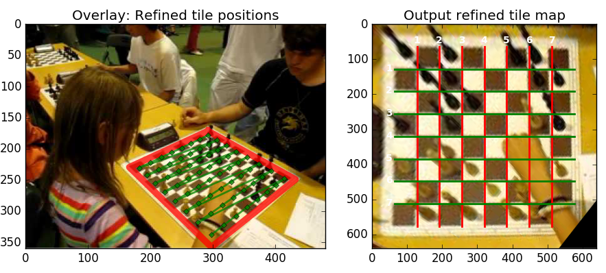
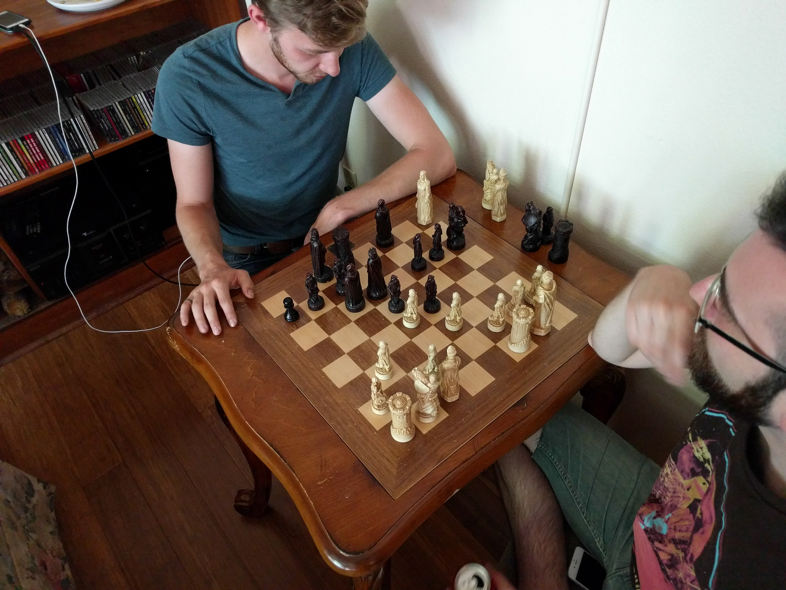

# Chessboard Detection

## Goal

* Given a photo with a chess board in it, find the chessboard grid.

This is to be an evolution on [Tensorflow Chessbot](https://github.com/Elucidation/tensorflow_chessbot), working with real images.

### Current state

1. Use Probabilistic Hough Transform to find lines
2. Prune lines based on strong alternating normal gradient angle frequency (checkerboard pattern)
3. Cluster line sets into segments, and choose top two corresponding to two axes of chessboard pattern
4. Find set of line intersections to define grid points
5. Take bounding corner grid points and perspective warp image

*TODO, implement previous comp vision algorithm for rectified chessboard images in this case*

### Example input image

## Some constraints:

* Chessboard can be populated with pieces, possibly partially occluded by hands etc. too
* Background can be crowded
* No user input besides the image taken

## Prior Work

There exists checkerboard detection algorithms, but they assume no occlusions, consistent black/white pattern, and clean demarcation with the background. We may be dealing with textured/patterned surfaces, heavy occlusion due to pieces or people's hands, etc., and the background may interrupt to the edges of the chessboard.

## Current Work

A promising approach is Gradient Angle Informed Hough transforms to find chessboard lines, once again taking advantage of the alternating gradient angles of the internal chessboard tiles.
